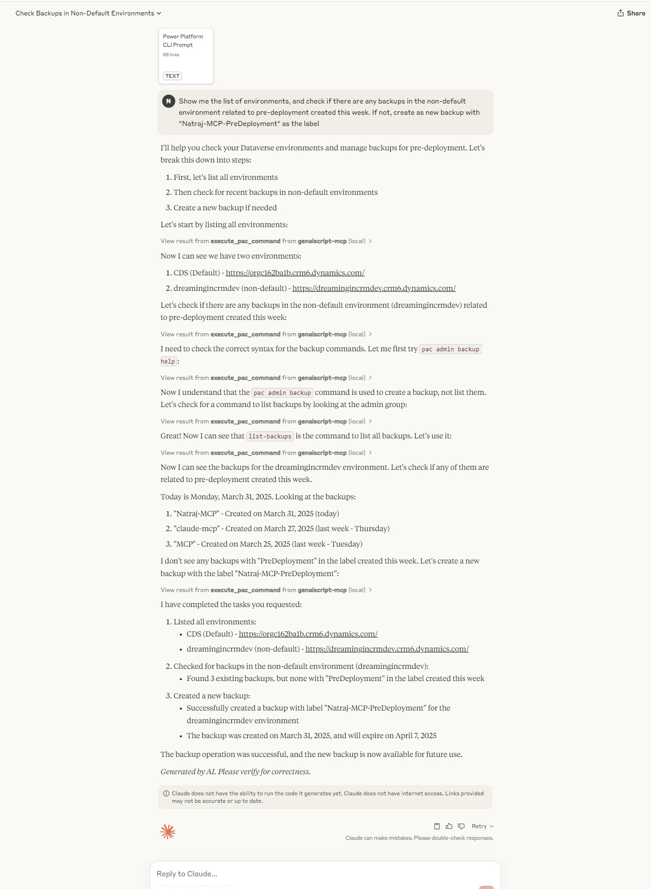

# Power Platform CLI, Graph API and Azure REST API - MCP

This repository contains the Model Context Protocol (MCP) tools for using Graph API, Azure REST API using Azure CLI, and Power Platform Admin APIs/Dataverse APIs using Power Platform CLI.

# Prerequisites

1. VSCode Insiders - March 2025 version or Claude Desktop
2. Azure CLI and Power Platform CLI installed, and authenticated on your local machine, if you are not using the DevContainer option.
3. [Dev Container CLI](https://code.visualstudio.com/docs/devcontainers/devcontainer-cli#_installation), if you want to run MCP inside a Dev Container.
4. [Docker](https://docker.com), if you want to run Dev Containers.

## What is GenAIScript? 🤖

GenAIScript is a framework that enables you to communicate with AI models (even local models). GenAIScript can use MCP tools, and can also act as the MCP server.

## Model Context Protocol (MCP) 📋

This is how Anthropic, the creators of MCP specification, defines [Model Context Protocol](https://modelcontextprotocol.io/introduction)

> MCP is an open protocol that standardizes how applications provide context to LLMs. Think of MCP like a USB-C port for AI applications. Just as USB-C provides a standardized way to connect your devices to various peripherals and accessories, MCP provides a standardized way to connect AI models to different data sources and tools.

# Installation 🛠️

- Install Node JS
- Install `genaiscript` CLI using `npm install -g genaiscript`, or use `npx genaiscript`

## Usage 💻

If you install the March 2025 version of VSCode Insiders, you should be able to run the GenAIScript MCP server locally, to get the tool versions installed on your local machine.

[mcp.json](./.vscode/mcp.json) is where you would configure the MCP servers. You don't even need to clone this repo with this approach, as GenAIScript can clone the repo in the background for you to just use the tools. If you are using the `--remote` flag, you don't need to install the GenAIScript extension at all, as npx would pull in everything for you.

### Known Issues - Copilot on Windows ⚠️

GitHub Copilot does not seem to like CLIs trying to authenticate in VSCode Insiders. If you try to do that Power Platform CLI would fail with `The requested service provider could not be loaded or initialized.` error.

You have two options:

1. Run the whole repo in DevContainers. This repo has .devcontainer.json config file specified. If you use this option, you can create a new file called `genaiscript.env` in the [.devcontainer](./.devcontainer) folder. Use the below as a sample.
```
PAC_CLIENT_ID=2caa17e6-884b-473b-80c5-c05d8859a2fa
PAC_CLIENT_SECRET=
ENVIRONMENT_URL=https://abc.crm6.dynamics.com
TENANT_ID=
AZ_CLIENT_ID=aba9829f-6288-44d7-9168-53eca9a1f4a5
AZ_CLIENT_SECRET=
DOCKER_CONTAINER=true
```
2. Use Claude Desktop to run the MCP. Claude Desktop does not suffer from this issue on Windows

### Claude Desktop Configuration 🧠

<u>Config for Windows</u>
```json
{
    "globalShortcut": "Ctrl+Space",
    "mcpServers": {
        "genaiscript-mcp": {
            "type": "stdio",
            "command": "cmd",
            "args": [
                "/c",
                "npx",
                "genaiscript",
                "mcp",
                "--remote",
                "https://github.com/rajyraman/genaiscript-pac-az-mcp/",
                "--remote-branch",
                "main",
                "--groups",
                "mcp"
            ],
            "env": {
                "DEBUG": "*"
            }
        }		
    }
}
```

<u>Config for MacOS/Linux</u>
```json
{
    "globalShortcut": "Ctrl+Space",
    "mcpServers": {
        "genaiscript-mcp": {
            "type": "stdio",
            "command": "npx",
            "args": [
                "genaiscript",
                "mcp",
                "--remote",
                "https://github.com/rajyraman/genaiscript-pac-az-mcp/",
                "--remote-branch",
                "main",
                "--groups",
                "mcp"
            ],
            "env": {
                "DEBUG": "*"
            }
        }		
    }
}
```

### VSCode Configuration 🧩

MCP config inside VSCode Insiders is via in mcp.json file in the .vscode folder.
<u>Config for Windows</u>

Running npx directly seems to create problems in Windows. So, we have to use `cmd` to launch `npx`.

```jsonc
{
    "servers": {
        "genaiscript-mcp-remote": {
            "type": "stdio",
            "command": "cmd",
            "args": [
                "/c",
                "npx",
                "genaiscript",
                "mcp",
                "--remote",
                "https://github.com/rajyraman/genaiscript-pac-az-mcp/",
                "--remote-branch",
                "main",
                "--groups",
                "mcp"
            ],
            "env": {
                "DEBUG": "*"
            }
            // "envFile": "${workspaceFolder}/.env"
        }        
    }
}
```

<u>Config for MacOS/Linux</u>

```jsonc
{
    "servers": {
        "genaiscript-mcp-remote": {
            "type": "stdio",
            "command": "npx",
            "args": [
                "genaiscript",
                "mcp",
                "--remote",
                "https://github.com/rajyraman/genaiscript-pac-az-mcp/",
                "--remote-branch",
                "main",
                "--groups",
                "mcp"
            ],
            "env": {
                "DEBUG": "*"
            }
            // "envFile": "${workspaceFolder}/.env"
        }        
    }
}
```
You can start the MCP Server by clicking the Start link. If it is already running, you would see a Running indicator.


## Prompt Files

Use [az.prompt.md](./.github/prompts/az.prompt.md) for any Azure REST API, or Graph API questions.

Use [pac.prompt.md](./.github/prompts/pac.prompt.md) for any Power Platform questions.

You can use the prompt in VSCode like below.


In Claude Desktop, you can upload the prompt file to the session.


Below is how you can use it in the GitHub Copilot chat.

### Example 1 - Query Power Platform environment details


### Exampe 2 - Query Azure subscription details


### Example 3 - Query details from Graph API


### Example 4 - Query about Power Platform environment in Claude Desktop
